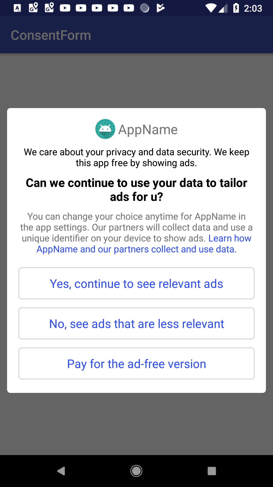

# ConsentDialog   [](https://jitpack.io/#saiakhil90/ConsentDialog)

A Fully Customisable, Simple and Easy to use Library for Custom Consent Form.Looks alike Admob Consent Form and Does everything we want.This Library is for those who have more than 12 adproviders in admob..However can be used for universal AdNetworks.

| MainLayout-Shown Immediately after Calling show        |Shown When users click on LearnHow in mainLayout|Shown When Users Clicks on NonPersonalisedButton|
|-------------|-------------|-------------|
      |  |  
 


 # Features
 
 * Fully Customisable (Colours Customisation will be added in future)
 * Google AdMob ConsentForm look Alike.
 * Simple Fast and Easy to use
 * Behaviour Similar to Admob Consent Form
 
 
 # How To Use
 
 AdProviders Class Contains 3 childs.Create an arrayList of adProviders.We need to show list of adProviders and their privayPolicy to the end user..So we get list of adProviders from the respective adNetworks and add it to the AdProviders ArrayList
 
 ```
    ArrayList<AdProviders> adProviders = new ArrayList();
    
    adProviders.add(new AdProviders(id,name,privacyUrl))
 
    //Here id,name and privacyUrl are strings
 ```
 
 NextCreate dialog as it is
 
 
 ```
    //Pass the adProviders arraylist in the constructor
    
    ConsentDialog consentDialog = new ConsentDialog.Builder(this,adProviders)
                .withSelectionListeners(new ConsentSelectionListener() {
                    @Override
                    public void onPersonalisedAdsSelected() {
                      //Called when user clicks on Choose Personalised Button
                    }

                    @Override
                    public void onNonPersonalisedAdsSelected() {
                      //WHen clicks agree on NonPersonalisedPage
                    }

                    @Override
                    public void onPaidServiceSelected() {
                        //WHen user clicks paidButton
                    }
                })
                .appName("AppName")
                .icon(getResources().getDrawable(R.mipmap.ic_launcher))
                .privacyUrl("https://saiakhil.com")
                
           //Choose the Buttons u want
           
                .withPaidOption()
                .withPersonalisedAdsOption()
                .withNonPersonalisedAdsOption()
                
           //Set if u want privacyPolicyClickListener
                .withPrivacyPolicyClickListener(new ConsentDialog.Builder.PrivacyPolicyClickListener() {
                    @Override
                    public void onPrivacyPolicyClicked(String privacyUrl) {
                                         
                    }
                })   
                
           //Build     
           
                .build();

        //Show Consent Dialog
        consentDialog.show();
 
 
 
 ```
 
 
 
 Texts can be customised Completely
 
 ```
 
    
    ConsentDialog consentDialog = new ConsentDialog.Builder(this,adProviders)
                .withSelectionListeners(new ConsentSelectionListener() {
                    @Override
                    public void onPersonalisedAdsSelected() {
                      //Called when user clicks on Choose Personalised Button
                    }

                    @Override
                    public void onNonPersonalisedAdsSelected() {
                      //WHen clicks agree on NonPersonalisedPage
                    }

                    @Override
                    public void onPaidServiceSelected() {
                        //WHen user clicks paidButton
                    }
                })
                .appName("AppName")
                .icon(getResources().getDrawable(R.mipmap.ic_launcher))
                .privacyUrl("https://saiakhil.com")
                
           //Choose the Buttons u want
           
                .withPaidOption()
                .withPersonalisedAdsOption()
                .withNonPersonalisedAdsOption()
                
           //Customise Texts
                .agreeButtonText("Agree")
                .backButtonText("Back")
                .mainLabelText("We collect etc etc")
                .mainPageExplanationAndLearnHowLabel("Ex","LearnHow")
                
           //Build     
           
                .build();

        //Show Consent Dialog
        consentDialog.show();
 
 ```
 
 
 # Note
 
 * Set `.appName()` and `.icon()` compulsory.
 
 * Set Required Button..If u dont set Dialog wont show any ..Set Buttons in this way `.withPersonalisedAdsOption()`.
 
 * Set PrivacyClickListener if required -- `.withPrivacyPolicyListener(PrivacyPolicyListener)`.
 
 # Installation
 
 Add Jitpack to ur Project build.gradle
 
 ```
    repositories {
        maven { url 'https://jitpack.io' }
    }
 
 ```
 
 
 Add ConsentDialog to ur app Build.gradle
 
 ```
    implementation 'com.github.saiakhil90:ConsentDialog:v(LatestRelease)'
 
 ```
 
 # Credits
 
 This project was initiated by SaiAkhil V(IGCORPORATION.IN). You can contribute to this project by submitting issues or/and by forking this repo and sending a pull request.
 
 Follow us on:

[](https://twitter.com/saiakhil13)

Hire Me On:

[](https://www.upwork.com/o/profiles/users/_~013788d80534af363d/)

Author: [SaiAkhil](https://github.com/saiakhil90)


# License

```
    Copyright (C) 2018  VENKATA SAI AKHIL KUMAR VEMULA (IGCORPORATION.IN)

    Licensed under the Apache License, Version 2.0 (the "License");
    you may not use this file except in compliance with the License.
    You may obtain a copy of the License at
    
        http://www.apache.org/licenses/LICENSE-2.0
    
    Unless required by applicable law or agreed to in writing, software
    distributed under the License is distributed on an "AS IS" BASIS,
    WITHOUT WARRANTIES OR CONDITIONS OF ANY KIND, either express or implied.
    See the License for the specific language governing permissions and
    limitations under the License.

```
     
